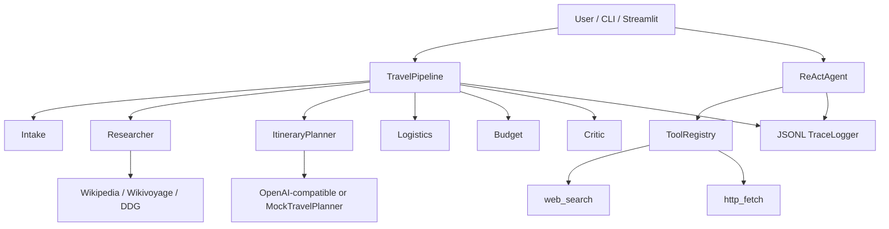

# Agent Workbench / 智能体工作台

> **Flagship: Travel Planning Agent** — multi-stage itineraries with transport, lodging, attractions, and budget.  
> **旗舰功能：旅行规划 Agent** — 多智能体管道输出交通 / 住宿 / 景点 / 预算明细。

Interview-ready portfolio for **LLM / Agent Engineer** roles.  
面向大模型 / Agent 工程师岗位的面试作品集。

**Repo:** `agent-workbench` · **Offline demo:** `--mock` / `AGENT_WB_MOCK=1`（无需 API Key）

---

## Reliability / 可靠性说明（请先读）

| Mode | What you get |
| --- | --- |
| **Mock / 示例** | Curated sample plans（成都3日 / 东京5日 / 云南大理丽江）+ deterministic budget math. Clearly marked **示例数据**. |
| **Live web + LLM** | Researcher fetches Wikipedia / Wikivoyage / DuckDuckGo snippets; LLM drafts itinerary; Critic revises once. |

**Honesty rules baked into prompts & code comments:**

- Never invent specific **live hotel prices** as facts — always label **估算**
- Prefer citing **source URLs** from research
- Critic flags unrealistic **same-day long-distance hops**（同日超长跨城）

Live web search and LLM quality depend on network + your `OPENAI_*` endpoint. When unsure, use `--mock`.

---

## English

### Why this project
Hiring managers want to see that you can **build an agent loop**, not only call a chat API. This repo is a complete workbench plus a production-style **Travel Planning** pipeline:

- **Travel pipeline:** Intake → Researcher → ItineraryPlanner → Logistics → Budget → Critic (one revision)
- Explicit **ReAct** loop (Thought → Action → Observation → Final Answer)
- **Tool registry:** calculator, HTTP fetch, **web_search**, sandboxed file read, datetime, memory notes, JSON query
- Short-term chat memory + long-term SQLite memory
- **JSONL traces** for observability
- OpenAI-compatible client + **MockLLM** / **MockTravelPlanner** offline path
- **CLI** + **Streamlit** UI (default tab = 旅行规划)

### Architecture



### Quick start — Travel Planner (mock)

```bash
cd path/to/agent-workbench
python -m venv .venv
# Linux/macOS
source .venv/bin/activate
# Windows PowerShell: .\.venv\Scripts\Activate.ps1
pip install -e ".[dev]"

# Flagship demo
python -m agent_workbench travel --dest 成都 --days 3 --budget 4000 --mock

# Other samples
python -m agent_workbench travel --dest 东京 --days 5 --budget 12000 --origin 上海 --mock
python -m agent_workbench travel --dest 云南大理丽江 --days 5 --budget 6000 --mock

# Streamlit (default tab: 旅行规划)
streamlit run app.py
```

### ReAct agent (legacy demo)

```bash
export AGENT_WB_MOCK=1   # PowerShell: $env:AGENT_WB_MOCK=1
python -m agent_workbench --mock "Calculate 12 * 7 + 3"
python -m agent_workbench --mock --multi "What time is it and calculate 9*9"
```

### Real LLM + web research

```bash
cp .env.example .env
# set OPENAI_API_KEY / OPENAI_BASE_URL / OPENAI_MODEL
# AGENT_WB_MOCK=0
python -m agent_workbench travel --dest 成都 --days 3 --budget 4000 --origin 上海
```

Compatible with OpenAI, Azure OpenAI gateways, Ollama proxies, DeepSeek, etc.

### Tests

```bash
pytest -q
```

### Interview talking points
- Designed a **multi-stage travel agency pipeline** with structured Pydantic schemas and Chinese Markdown rendering.
- Separated **deterministic budget math** from LLM creativity; enforced 估算 labeling.
- Built **MockTravelPlanner** curated samples so reviewers run offline without keys.
- Extended tool registry with best-effort **web_search** (graceful failure).
- Kept classic **ReAct** runtime, dual memory, and JSONL traces for interview walkthroughs.

### Project layout

```
src/agent_workbench/
  travel/           # flagship Travel Planning Agent
    schema.py       # TripRequest, DayPlan, TripPlan, ...
    research.py     # httpx + DDG / Wikipedia / Wikivoyage
    pipeline.py     # Intake→…→Critic
    render.py       # 旅行社风格中文 Markdown
    mock_plans.py   # 成都 / 东京 / 云南 示例
    budget.py       # CNY tier defaults + rollup
  agent.py / multi_agent.py / llm.py / memory.py / trace.py
  tools/            # + web_search, http_fetch, ...
  cli.py / ui.py
app.py
tests/
```

---

## 中文

### 旗舰：旅行规划 Agent
把 Agent Workbench 升级为「旅行社风格」规划器：输出交通、住宿、景点与预算拆解。默认中文 UX。

**管道：** 受理 → 调研 → 行程策划 → 后勤 → 预算 → 审稿（一轮修订）

**可靠性：**

- Mock 模式使用标注为 **示例数据** 的精选行程，预算为确定性估算。
- 真实模式依赖网络检索 + LLM；**从不把虚构酒店成交价写成事实**，一律标 **估算**。
- Critic 会标记同日不合理长距跳跃。

### 快速开始（Mock）

```bash
pip install -e ".[dev]"
python -m agent_workbench travel --dest 成都 --days 3 --budget 4000 --mock
streamlit run app.py
```

Streamlit 默认打开 **旅行规划** 页签：目的地、天数、预算、人数、出发地、偏好、节奏；可查看阶段轨迹、渲染 Markdown、下载 `.md`。次要页签为工具聊天。

### 真实模型
复制 `.env.example` → `.env`，填写 `OPENAI_API_KEY` 等，去掉 `--mock`。

### 测试

```bash
pytest -q
```

### 面试讲解要点
- 多阶段旅行社管道 + Pydantic 结构化输出 + 中文 Markdown
- 预算数学与 LLM 解耦；强制「估算」口径与来源引用
- Mock 精选样本保证无密钥可演示
- web_search 尽力而为、失败可降级
- 保留 ReAct、双层记忆与 JSONL 轨迹

### License
MIT
