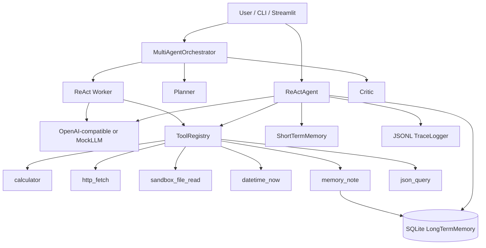

# Agent Workbench / 智能体工作台

> Interview-ready portfolio project for **LLM / Agent Engineer** roles.  
> 面向大模型 / Agent 工程师岗位的面试作品集项目。

**Repo name:** `agent-workbench` · **Offline demo:** `AGENT_WB_MOCK=1` (no API key)

---

## English

### Why this project
Hiring managers want to see that you can **build an agent loop**, not only call a chat API. This repo is a small but complete workbench:

- Explicit **ReAct** loop (Thought → Action → Observation → Final Answer)
- **Tool registry** with calculator, HTTP fetch, sandboxed file read, datetime, memory notes, JSON query
- **Short-term** chat memory + **long-term** SQLite memory
- **JSONL traces** for observability (interview-friendly)
- **OpenAI-compatible** client via env vars
- **MockLLM** so the default path runs offline
- Simple **multi-agent** pipeline: Planner → Worker → Critic
- **CLI** + **Streamlit** UI with demo prompts

### Architecture



### Quick start (mock / offline)

```bash
# Windows PowerShell
cd path\to\agent-workbench
python -m venv .venv
.\.venv\Scripts\Activate.ps1
pip install -e ".[dev]"

# CLI mock demo
$env:AGENT_WB_MOCK=1
python -m agent_workbench --mock "Calculate 12 * 7 + 3"

# Streamlit UI
streamlit run app.py
```

### Real LLM

```bash
cp .env.example .env
# set OPENAI_API_KEY / OPENAI_BASE_URL / OPENAI_MODEL
# AGENT_WB_MOCK=0
python -m agent_workbench "Read sandbox_data/faq.md and summarize"
```

Compatible with OpenAI, Azure OpenAI (compatible gateway), Ollama proxies, DeepSeek, etc. — any `/v1/chat/completions` endpoint.

### Multi-agent mode

```bash
python -m agent_workbench --mock --multi "What time is it and calculate 9*9"
```

### Tests

```bash
pytest -q
```

### Interview talking points / resume bullets
- Designed a readable **ReAct agent runtime** with stop sequences, JSON tool args, and max-step safety.
- Built a **tool registry** pattern (schema + handler) used by both CLI and UI.
- Added **dual memory**: session buffer + SQLite notes exposed as a tool.
- Implemented **JSONL tracing** (thought / tool_call / tool_result / final_answer) for debugging demos.
- Shipped **MockLLM** so reviewers can run the portfolio without credentials.
- Demonstrated a minimal **Planner → Worker → Critic** multi-agent topology.

### Project layout

```
src/agent_workbench/
  agent.py          # ReAct loop
  multi_agent.py    # Planner → Worker → Critic
  llm.py            # OpenAI-compatible + MockLLM
  memory.py         # short-term + SQLite
  trace.py          # JSONL observability
  tools/            # calculator, http_fetch, sandbox_file_read, ...
  cli.py / ui.py
app.py              # streamlit run app.py
sandbox_data/       # demo files for file tool
tests/
```

---

## 中文

### 项目价值
面试官想看到你能**手写 Agent 循环**，而不只是调 Chat API。本仓库是一个小而完整的 Agent 工作台：

- 显式 **ReAct** 循环（思考 → 工具 → 观察 → 最终回答）
- **工具注册表**：计算器、HTTP、沙箱读文件、时间、记忆笔记、JSON 查询
- **短期对话记忆** + **SQLite 长期记忆**
- **JSONL 轨迹**便于讲解可观测性
- 通过环境变量接入 **OpenAI 兼容**接口
- **MockLLM** 默认可离线跑通
- 简单多智能体：**Planner → Worker → Critic**
- **CLI** + **Streamlit** 界面与演示提示词

### 架构说明
见上方 Mermaid 图：用户入口 → ReAct / 多智能体编排 → LLM → ToolRegistry → 记忆与 Trace。

### 快速开始（Mock / 离线）

```powershell
cd 仓库目录
python -m venv .venv
.\.venv\Scripts\Activate.ps1
pip install -e ".[dev]"
$env:AGENT_WB_MOCK=1
python -m agent_workbench --mock "计算 12 * 7 + 3"
streamlit run app.py
```

### 真实模型
复制 `.env.example` 为 `.env`，填写 `OPENAI_API_KEY` / `OPENAI_BASE_URL` / `OPENAI_MODEL`，将 `AGENT_WB_MOCK=0`。

### 测试

```powershell
pytest -q
```

### 面试讲解要点 / 简历子弹
- 实现可读的 ReAct 运行时（停止词、JSON 参数、最大步数保护）
- Tool Registry 模式统一 CLI 与 UI
- 双层记忆：会话缓冲 + SQLite，并以 tool 暴露
- JSONL 全链路追踪，便于现场 Debug
- MockLLM 保证无密钥可演示
- 展示 Planner→Worker→Critic 最小多智能体拓扑

### License
MIT
